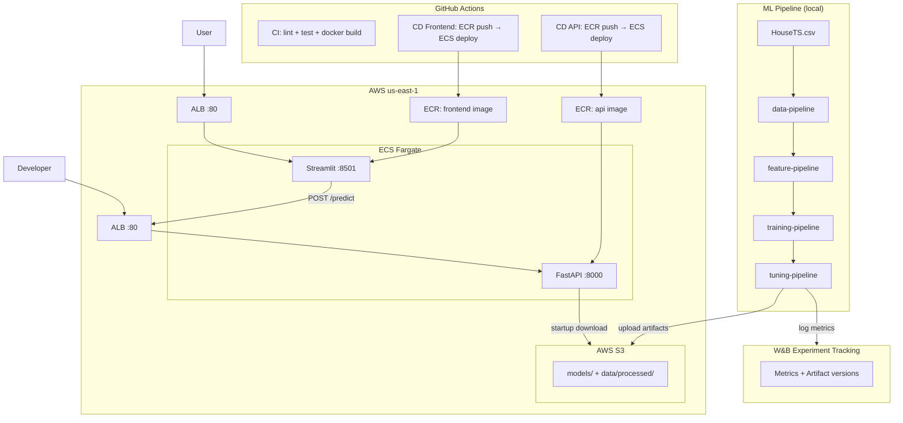

# Regression MLOps E2E

[](https://github.com/FabioCLima/Regression_MLOps_e2e/actions/workflows/ci.yml)
[](https://github.com/FabioCLima/Regression_MLOps_e2e/actions/workflows/cd.yml)
[](https://github.com/FabioCLima/Regression_MLOps_e2e/actions/workflows/cd-frontend.yml)
[](https://www.python.org/downloads/)
[](https://github.com/astral-sh/uv)
[](https://github.com/astral-sh/ruff)

End-to-end MLOps pipeline for US real estate price prediction (2012–2022).  
Covers every phase from raw data to production serving on AWS, with automated CI/CD.

**Live demo:**

- Frontend: [Streamlit on AWS ECS Fargate](http://reg-mlops-fe-alb-1328758802.us-east-1.elb.amazonaws.com)
- API docs: [FastAPI /docs on AWS ECS Fargate](http://regression-mlops-e2e-alb-1975146041.us-east-1.elb.amazonaws.com/docs)

---

## Architecture



---

## ML Pipeline

```text
HouseTS.csv
  → temporal split (train / eval / holdout)
  → preprocessing + lat/lng merge
  → feature engineering (date features, frequency encoding, target encoding)
  → model selection (Dummy, LinearRegression, Ridge, RandomForest, XGBoost)
  → hyperparameter tuning (Optuna, 15 trials)
  → REST API serving (FastAPI)
  → Streamlit frontend
```

**Temporal validation — no data leakage:**

| Split | Date range |
|-------|------------|
| Train | before 2020-01-01 |
| Eval | 2020-01-01 → 2021-12-31 |
| Holdout | from 2022-01-01 |

---

## Model Performance

| Model | RMSE (eval) | R² (eval) |
|-------|-------------|-----------|
| Dummy Regressor | $375,960 | -0.09 |
| Linear Regression | $121,635 | 0.886 |
| Ridge | $121,638 | 0.886 |
| Random Forest | $83,879 | 0.946 |
| XGBoost | $73,824 | 0.958 |
| **XGBoost + Optuna tuning** | **$69,483** | **0.963** |

Optuna tuning (15 trials) reduced RMSE by **5.9%** over the baseline XGBoost.

---

## Stack

| Layer | Technology |
|-------|------------|
| API | FastAPI + Uvicorn |
| ML | XGBoost, scikit-learn, Optuna, category-encoders |
| Experiment tracking | Weights & Biases |
| Serving infra | AWS ECS Fargate + Application Load Balancer |
| Artifact storage | AWS S3 |
| Container registry | AWS ECR |
| CI/CD | GitHub Actions — OIDC auth (no long-lived AWS credentials) |
| Frontend | Streamlit |
| Package manager | uv |
| Linter | Ruff |
| Tests | pytest + FastAPI TestClient |

---

## API Endpoints

| Method | Path | Description |
|--------|------|-------------|
| `GET` | `/` | Service info |
| `GET` | `/health` | Liveness + artifact status |
| `GET` | `/model-info` | Model version, source, feature schema |
| `POST` | `/predict` | Single prediction |
| `POST` | `/predict/batch` | Batch prediction (up to 1000 records) |

Minimum required payload for `/predict`:

```json
{
  "date": "2022-01-01",
  "city_full": "Atlanta-Sandy Springs-Alpharetta",
  "city": "ATL",
  "zipcode": 30301
}
```

All other fields (market metrics, POI counts, demographics) are optional and improve prediction quality. Missing fields are reported in `missing_features`.

---

## CI/CD Workflows

Three independent workflows with path-based triggers — no unnecessary deploys:

| Workflow | Trigger | Action |
|----------|---------|--------|
| `ci.yml` | every push + PR | lint, pytest, docker build (both images) |
| `cd.yml` | push to main (src/ changes) | build → push ECR → deploy ECS API |
| `cd-frontend.yml` | push to main (app.py / Dockerfile.streamlit) | build → push ECR → deploy ECS Frontend |

AWS authentication uses **OIDC** — no AWS access keys stored in GitHub Secrets.

---

## Local Setup

This project uses [uv](https://github.com/astral-sh/uv) for dependency management.

```bash
# Install dependencies
uv sync

# Authenticate W&B (required for pipelines that log artifacts)
uv run wandb login
```

Expected raw dataset:

```
data/raw_data/HouseTS.csv
```

---

## Running the Pipeline

Run each phase independently (recommended for learning):

```bash
uv run data-pipeline        # split + preprocess → data/processed/
uv run feature-pipeline     # feature engineering → data/processed/ + models/
uv run training-pipeline    # train candidates, save best model → models/
uv run tuning-pipeline      # Optuna tuning → models/xgboost_tuned_model.pkl
uv run inference-pipeline --input data/processed/holdout.csv
```

Or run the full pipeline at once:

```bash
uv run machine-learning-pipeline
uv run machine-learning-pipeline --include-inference   # with inference
uv run machine-learning-pipeline --skip-data --skip-features  # skip completed stages
```

---

## Running the API Locally

```bash
uv run uvicorn src.api.app:app --host 0.0.0.0 --port 8000
```

Check health:

```bash
curl http://localhost:8000/health
```

Run a prediction:

```bash
curl -X POST http://localhost:8000/predict \
  -H "Content-Type: application/json" \
  -d '{"date":"2022-01-01","city_full":"Atlanta-Sandy Springs-Alpharetta","city":"ATL","zipcode":30301}'
```

---

## Running with Docker

```bash
# API — requires S3 bucket with artifacts uploaded
docker build -f Dockerfile.api -t regression-mlops-e2e-api .
docker run --rm -p 8000:8000 \
  -e AWS_S3_BUCKET=<your-bucket> \
  -v ~/.aws:/root/.aws:ro \
  regression-mlops-e2e-api

# Frontend
docker build -f Dockerfile.streamlit -t regression-mlops-e2e-frontend .
docker run --rm -p 8501:8501 \
  -e API_BASE_URL=http://localhost:8000 \
  regression-mlops-e2e-frontend
```

---

## Tests and Linting

```bash
uv run pytest -q
uv run ruff check app.py src pipelines tests
```

The API test suite uses fake artifacts and FastAPI `TestClient` — no model files required to run tests.

---

## Project Structure

```
src/
  config.py              # Pydantic-based centralized config
  logging_config.py
  data/
    load_data.py
    split_data.py
    preprocess_data.py
  features/
    feature_engineering.py
  models/
    train_model.py
    tune_model.py
  inference/
    predict.py
  api/
    app.py               # FastAPI application
    schemas.py           # Pydantic request/response models
    service.py           # Prediction logic
    model_loader.py      # S3 + local artifact loading
    middleware.py        # X-Request-ID tracing

pipelines/               # Orchestration scripts (entry points)
tests/                   # pytest — 9 test modules
infra/aws/               # ECS task definitions, IAM policies
.github/workflows/       # CI + CD API + CD Frontend
```

**Mental model:**
- `src/` — reusable, tested library code
- `pipelines/` — execution order, entry points
- `tests/` — protects expected behavior
- `infra/aws/` — infrastructure-as-config

---

## Key Engineering Decisions

| Decision | Rationale |
|----------|-----------|
| OIDC for AWS auth in CI/CD | No long-lived credentials in GitHub Secrets |
| Artifacts downloaded from S3 at container startup | Immutable image, independently versioned artifacts |
| Fake artifacts in tests | Tests run fast without needing real model files |
| Pydantic `extra="forbid"` on request schema | Strict contract — unknown fields return 422 |
| Path-based CI/CD triggers | Doc-only commits don't trigger ECS deploys |
| `concurrency: cancel-in-progress` on CD | Two fast pushes don't cause a deploy race condition |
| Temporal train/eval/holdout split | Prevents data leakage in time-series data |
| `X-Request-ID` middleware | Every request traceable across logs |
